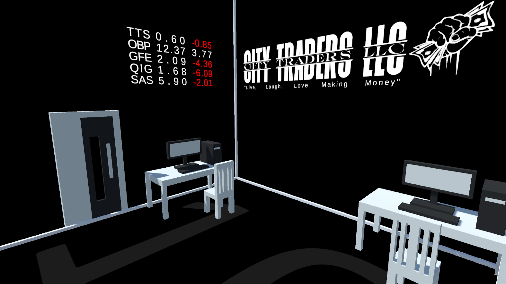
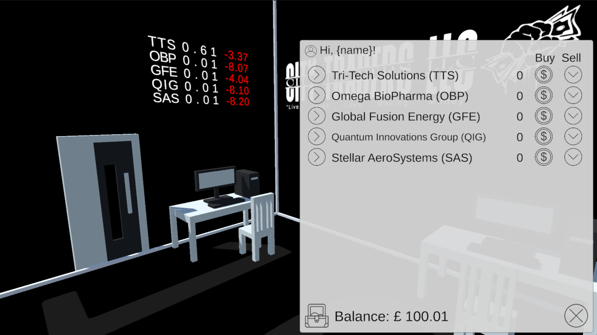

# City Traders LLC

## Live, Laugh, Love Making Money

A Unity/C# remake of my early [Stock Trading Game](https://github.com/Matt-J-Jones/Stock-Trader-Game) originally written in Python.

### Assets Used

[1Bit Voxel Assets](https://willemdoll.itch.io/1bit-voxel-assets)

[Dark Theme UI](https://assetstore.unity.com/packages/2d/gui/dark-theme-ui-199010)

[Font: Money, money, money](https://www.dafont.com/money-money-money.font)

[Font: Money Money](https://www.dafont.com/money-money.font)

[Font: Moneymachine](https://www.dafont.com/moneymachine.font)
